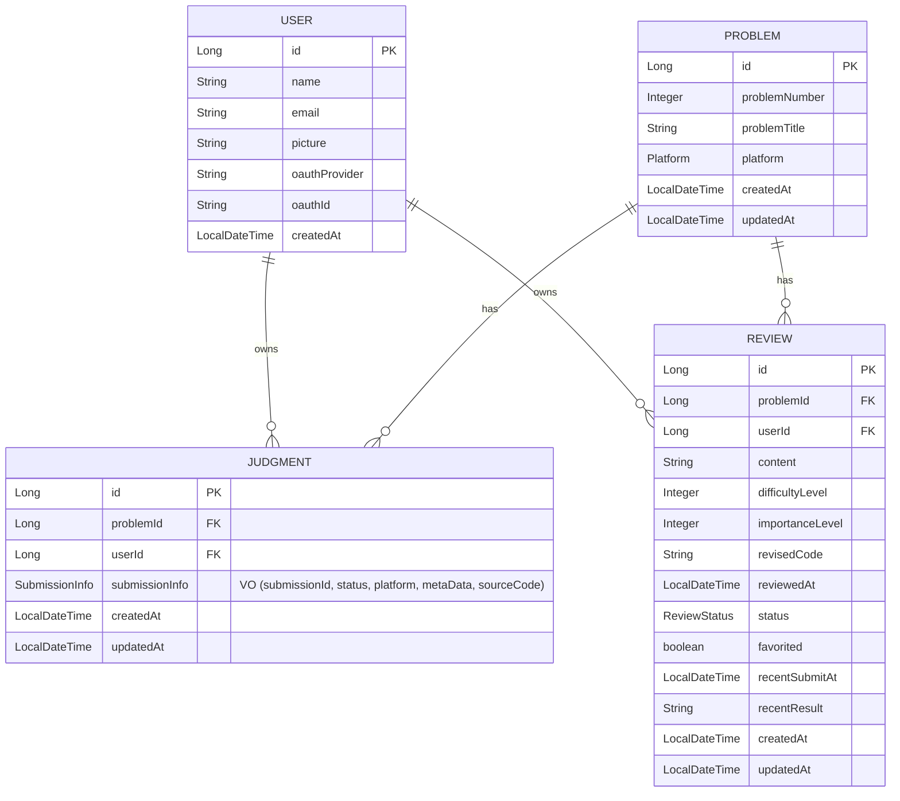

<h1 align="center">
  <br>
  <a href="https://github.com/zzoe2346/MyCodingTest_BACKEND"></a>
  <br>
  MY CODING TEST
  <br>
</h1>

<h4 align="center">백준 문제 풀이 기록을 자동 수집하고 복습을 도와주는 서비스</h4>

<p align="center">
     
     
     
     
</p>

<p align="center">
  <a href="#data-collection--review-pipeline">Data Collection & Review Pipeline</a> •
  <a href="#multi-module-architecture">Multi-Module Architecture</a> •
  <a href="#module-structure">Module Structure</a> •
  <a href="#domain-model">Domain Model</a> •
  <a href="#getting-started">Getting Started</a> •
  <a href="#related-repositories">Related Repositories</a>
</p>

---
## Deployment Architecture
<p align="center">
  
</p>

## CI/CD Pipeline
<p align="center">

</p>


## Data Collection & Review Pipeline

<p align="center">


</p>

## Multi-Module Architecture

본 프로젝트는 **DDD(Domain-Driven Design)** 와 **계층형 아키텍처**를 적용한 멀티 모듈 구조로 설계되었습니다.

> [⭐️ 리팩토링 과정에대한 글](https://jeongseonghun.com/posts/Dev-refactoring-mycodingtest-with-ddd-and-multi-module)

<p align="center">

</p>

### 의존성 규칙

- **상위 레이어 → 하위 레이어** 방향으로만 의존
- **Domain Layer**는 어떤 모듈에도 의존하지 않음
- **Infrastructure Layer**는 Domain의 Repository 인터페이스를 구현

---

## Module Structure

### 📦 module-api

> Presentation Layer - REST API 엔드포인트

```
api/
├── SwaggerConfig.java           # Swagger API 문서 설정
├── auth/                        # 인증 관련 API
├── collector/                   # 외부 플랫폼 데이터 수집 API
├── judgment/                    # 채점 결과 조회 API
└── review/                      # 오답노트 CRUD API
    # 각 패키지 내부 구성은 다음과 같습니다.
    ├── ReviewCommandController.java
    ├── ReviewQueryController.java
    └── dto/
```

**Dependencies**: `module-application`, `module-domain`, `module-security`

---

### 📦 module-application

> Application Layer - 비즈니스 로직의 응집 및 트랜잭션 경계 설정, 도메인 객체들을 조합하여 비즈니스 유스케이스를 완성

```
application/
├── config/
│   └── AsyncConfig.java         # 비동기 처리 설정
├── collector/                   # 데이터 수집 서비스(Orchestration)
│   ├── BojIngestionService.java
│   └── dto/
├── judgment/                    # 채점 처리 서비스
│   ├── command/
│   │   ├── JudgmentCommandService.java
│   │   ├── CreateBojJudgmentCommand.java
│   │   └── DeleteJudgmentCommand.java
│   ├── query/
│   │   ├── JudgmentQueryService.java
│   │   └── JudgmentInfo.java
│   └── support/
├── problem/                     # 문제 정보 서비스
│   └── command/
├── review/                      # 복습 관리 서비스
│   ├── command/
│   │   ├── ReviewCommandService.java
│   │   ├── CreateReviewCommand.java
│   │   ├── UpdateReviewCommand.java
│   │   └── UpdateReviewResult.java
│   └── query/
│       ├── ReviewQueryService.java
│       ├── ReviewInfo.java
│       ├── ReviewSummary.java
│       └── ReviewSummaryPage.java
└── user/                        # 사용자 관리 서비스
    ├── command/
    │   ├── UserCommandService.java
    │   ├── SyncUserCommand.java
    │   └── WelcomeService.java  # 신규 사용자 온보딩
    └── event/
        └── UserCreatedEventListener.java  # 비동기 이벤트 리스너
```

**Dependencies**: `module-domain`, `module-infra-rdb`

---

### 📦 module-domain

> Domain Layer - 핵심 비즈니스 로직 (순수 도메인)

```
domain/
├── common/                      # 공통
│   ├── DomainPage.java          # 페이지네이션 VO
│   ├── Platform.java            # 플랫폼 Enum
│   └── exception/               # 도메인 예외
│       ├── ResourceNotFoundException.java
│       ├── InvalidOwnershipException.java
│       └── NotOurUserException.java
├── judgment/                    # ⭐️채점 도메인
│   ├── Judgment.java            # Entity (Aggregate Root)
│   ├── JudgmentRepository.java  # Repository Interface
│   ├── JudgmentStatus.java      # Enum
│   ├── SubmissionInfo.java      # Value Object (제출 정보)
│   ├── MetaData.java            # Value Object (플랫폼별 메타데이터 인터페이스)
│   └── BojMetaData.java         # BOJ 플랫폼 메타데이터 구현체
├── problem/                     # 문제 도메인
│   ├── Problem.java
│   └── ProblemRepository.java
├── review/                      # ⭐️리뷰 도메인
│   ├── Review.java              # Entity (Aggregate Root)
│   ├── ReviewRepository.java    # Repository Interface
│   └── ReviewStatus.java        # Enum (TO_DO, IN_PROGRESS, COMPLETED)
└── user/                        # 사용자 도메인
    ├── User.java
    ├── UserRepository.java
    └── UserCreatedEvent.java    # 사용자 신규 생성 시 이벤트
```

**Dependencies**: 없음 (Spring Context, Validation만 사용)

---

### 📦 module-infra-rdb

> Infrastructure Layer - JPA 기반 영속성 구현

```
infra/
├── BaseEntity.java              # 공통 엔티티 (생성/수정 시간)
├── judgment/
│   ├── JudgmentEntity.java      # JPA Entity
│   ├── JpaJudgmentRepository.java   # Spring Data JPA
│   ├── JudgmentRepositoryImpl.java  # Repository 구현체
│   └── MetaDataConverter.java   # MetaData JSON 변환기
├── problem/
│   ├── ProblemEntity.java
│   ├── JpaProblemRepository.java
│   └── ProblemRepositoryImpl.java
├── review/
│   ├── ReviewEntity.java
│   ├── JpaReviewRepository.java
│   └── ReviewRepositoryImpl.java
└── user/
    ├── UserEntity.java
    ├── JpaUserRepository.java
    └── UserRepositoryImpl.java
```

**Dependencies**: `module-domain`

---

### 📦 module-security

> Security Layer - 인증/인가

```
security/
├── SecurityConfig.java           # Spring Security 설정
├── CustomOAuth2SuccessHandler.java   # OAuth2 성공 핸들러
├── CustomUserDetails.java        # UserDetails 구현
├── JwtFilter.java                # JWT 인증 필터
├── JwtUtil.java                  # JWT 유틸리티
├── CookieUtil.java               # 쿠키 관리
└── GlobalExceptionHandler.java   # 예외 핸들러
```

**Dependencies**: `module-domain`, `module-application`

---

## Domain Model



---

## System Architecture

### Deployment

<p align="center">
  
</p>

### CI/CD Pipeline

<p align="center">
  
</p>

---

## Getting Started

### Prerequisites

- Java 21
- MySQL 8.0+
- Gradle 8.x

### Run Locally

```bash
./gradlew bootRun
```

### Run Tests

```bash
./gradlew test
```

### Build

```bash
./gradlew :module-api:bootJar
```

---

## Related Repositories

| Repository                                                                   | Description      |
| ---------------------------------------------------------------------------- | ---------------- |
| [MyCodingTest_FE](https://github.com/zzoe2346/MyCodingTest_FE)               | React 프론트엔드 |
| [MyCodingTest_Connector](https://github.com/zzoe2346/MyCodingTest_Connector) | Chrome Extension |
